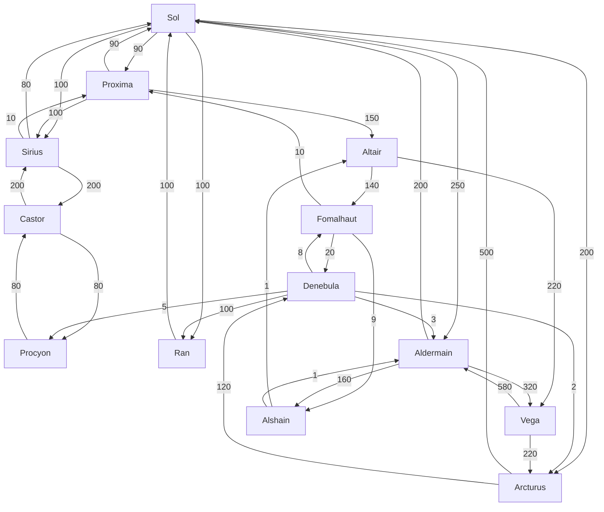

# Intersetellar Route Planner
# Brief
**Hyperspace Tunneling Corp** manages a system-to-system web of hyperspace gates that spans the United Terran Systems. They charge a fee to their users in order to use their network but they want to expand their business.

Recently, they've expanded into transporting people through their network using light transport space-ships that can take up to 5 people to the gate and then use their hyperspace-enabled ships to travel to the destination gate.

We've been asked to develop a system to help calculate the costs of this journey for their clients.

A journey is defined as:

1. Journey to the gate:
    * **Personal Transport**: £0.30/[AU](https://en.wikipedia.org/wiki/Astronomical_unit) (standard fuel cost) plus £5 per day for ship storage at the gate - (fits up to 4 people)
    * **HSTC Transport**: £0.45/[AU](https://en.wikipedia.org/wiki/Astronomical_unit) - (fits up to 5 people)

2. An outbound and an inbound hyperspace journey:
    * **Spaceflight**: £0.10/passenger/hyperplane-unit

> * [AU](https://en.wikipedia.org/wiki/Astronomical_unit) (Astronomical Unit) is roughly 149597870.7 Km - the average distance between the Earth and the Sun.
> * HU (Hyperplane Unit) is a fictional unit which measures the distance between two gates in the hyperplane - it has no correlation to real-space measurements.

HSTC keeps a table with its gates and their connections:

| Gate ID | Gate Name | Connections and Hyperplane units of distance (HU)                          |
| -------------- | ---------------- | -------------------------------------------------------------------------- |
| SOL            | Sol              | RAN: 100HU<br/>PRX: 90HU<br/>SIR: 100HU<br/>ARC: 200HU<br/>ALD: 250HU<br/> |
| PRX            | Proxima          | SOL: 90HU<br/>SIR: 100HU<br/>ALT: 150HU<br/>                               |
| SIR            | Sirius           | SOL: 80HU<br/>PRX: 10HU<br/>CAS: 200HU<br/>                                |
| CAS            | Castor           | SIR: 200HU<br/>PRO: 120HU<br/>                                             |
| PRO            | Procyon          | CAS: 80HU<br/>                                                             |
| DEN            | Denebula         | PRO: 5HU<br/>ARC: 2HU<br/>FOM: 8HU<br/>RAN: 100HU<br/>ALD: 3HU<br/>        |
| RAN            | Ran              | SOL: 100HU<br/>                                                            |
| ARC            | Arcturus         | SOL: 500HU<br/>DEN: 120HU<br/>                                             |
| FOM            | Fomalhaut        | PRX: 10HU<br/>DEN: 20HU<br/>ALS: 9HU<br/>                                  |
| ALT            | Altair           | FOM: 140HU<br/>VEG: 220HU<br/>                                             |
| VEG            | Vega             | ARC: 220HU<br/>ALD: 580HU<br/>                                             |
| ALD            | Aldermain        | SOL: 200HU<br/>ALS: 160HU<br/>VEG: 320HU<br/>                              |
| ALS            | Alshain          | ALT: 1HU<br/>ALD: 1HU<br/>                                                 |



Gates are typically one-way, so while the route `A->B` can exist, it doesn't necessarily mean that `B->A` exists. Additionally, the hyperplane distance varies depending on which way you travel - Our best theories say the hyperplane not only does not match real-space but also has a preferred direction.

## The task:
Write a server that exposes an API that allows a user to calculate the cost of their journey:
* From wherever they are to the nearest gate
* From one gate to a destination gate

The API should expose, at least, the following endpoints:
* `GET`: `/transport/{distance}?passengers={number}&parking={days}` - returns the cheapest vehicle to use (and the cost of the journey) for the given `distance` (in AUs), `number` or passengers and `days` of parking (i.e. vehicle storage at the gate)
    * Gates typically sit above the star, so if you're on Earth and want to travel to the Sol gate, the distance would be ~1AU.
* `GET`: `/gates` - returns a list of gates with their information
* `GET`: `/gates/{gateCode}` - returns the details of a single gate
* `GET`: `/gates/{gateCode}/to/{targetGateCode}` - returns the cheapest route from `gateCode` to `targetGateCode`

These endpoints should be public.

# The Implementation

## Spring Boot, MySQL, JPA, Rest API

Restful API for a simple application "Interstellar Route Planner" using Spring Boot, MySQL, JPA.

## Requirements

1. Java - 17

2. Maven - 3.x.x

3. MySQL - 9.x.x

## Steps to Setup

**1. Clone the application**

```
git clone https://github.com/franceslou1818/interstellar-route-planner
```

**2. Create MySQL database**
Run the query in `create-local-db.sql` using your local MySQL.

**3. Change mysql username and password as per your installation**

+ open `src/main/resources/application.properties`

+ change `spring.datasource.username` and `spring.datasource.password` as per your mysql installation

+ Comment out the property `spring.datasource.url` for deployment. Use the local property.

**4. Open and change `pom.xml`**

+ Comment out the `<build><plugin>` for deployment. Use the local plugins.

**5. Build and run the app using maven**

```
mvn package
java -jar target/interstellar.jar
```

Alternatively, you can run the app without packaging it using -

```
mvn spring-boot:run
```

## Rest APIs

The app defines following CRUD APIs.

    GET: {{baseUrl}}/transport/{distance}?passengers={number}&parking={days}

    GET: {{baseUrl}}/gates

    GET: {{baseUrl}}/gates/{gateCode}
    
    GET: {{baseUrl}}/gates/{gateCode}/to/{targetGateCode}

where `{{baseUrl}}` is `https://xdzx3lpsdk.execute-api.eu-north-1.amazonaws.com/dev`

Example of a public endpoint: `https://xdzx3lpsdk.execute-api.eu-north-1.amazonaws.com/dev/gates`

You can test them using postman or any other rest client.
You can use the supplied postman collection and environment files in directory `postman/`

